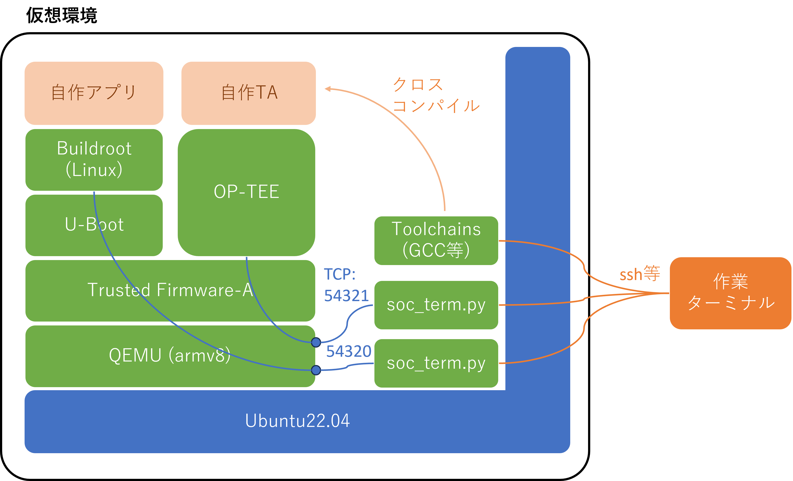
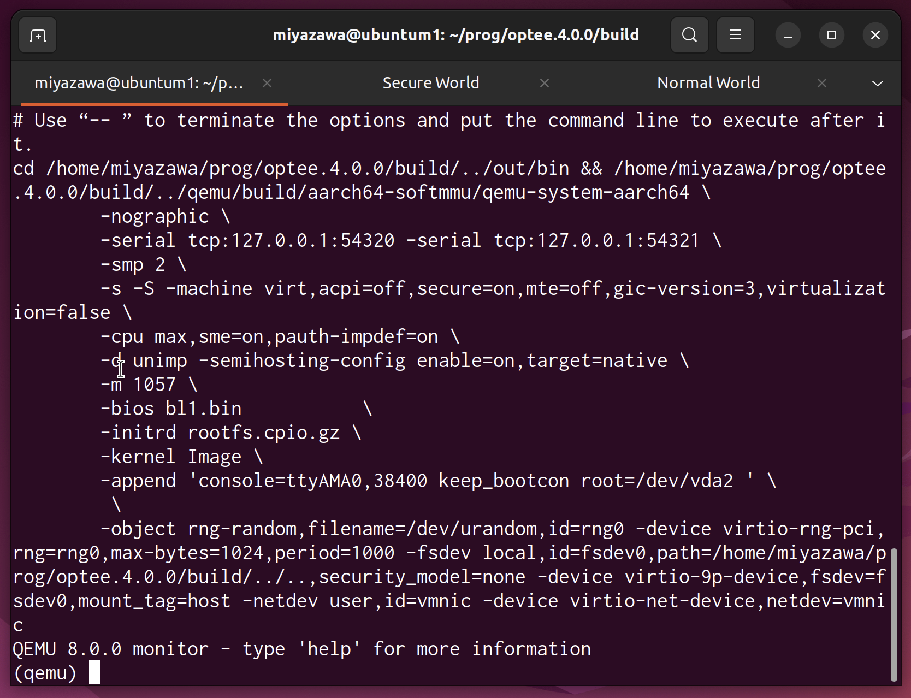
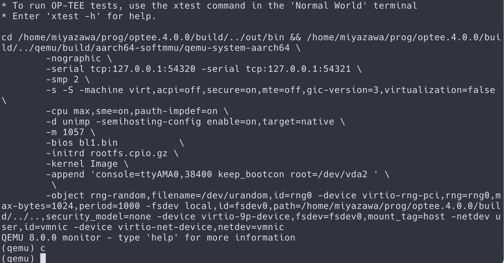
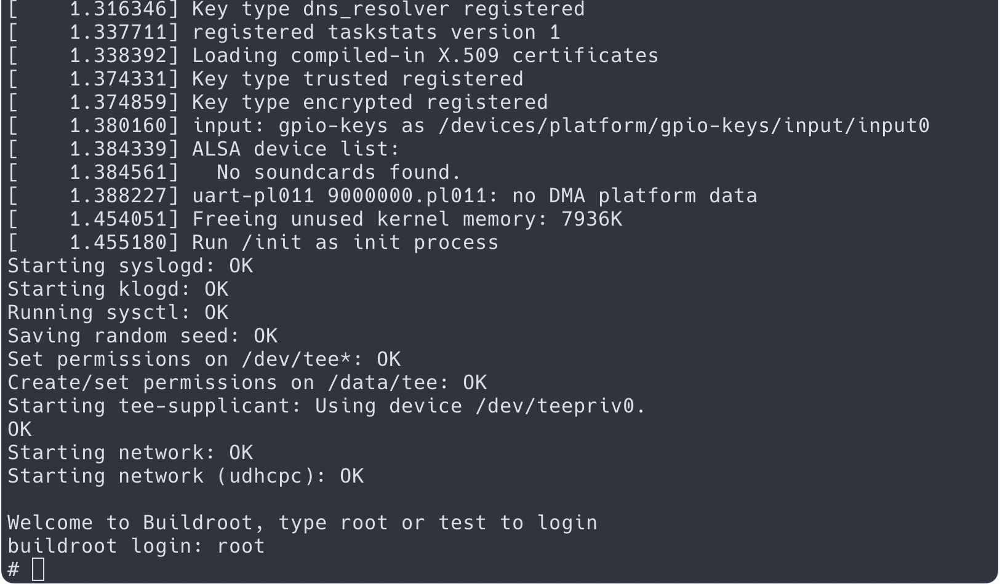
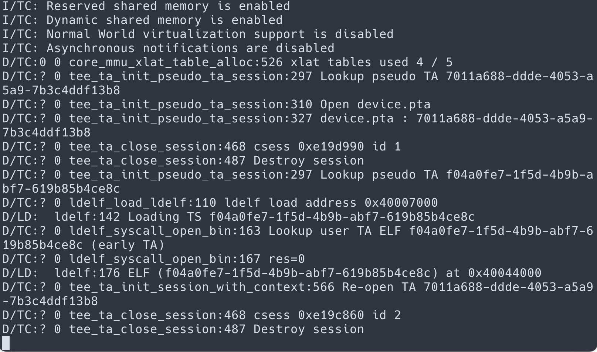

<!-- @import "[TOC]" {cmd="toc" depthFrom=1 depthTo=6 orderedList=false} -->

<!-- code_chunk_output -->

- [OP-TEE実験環境の構築手順](#op-tee実験環境の構築手順)
  - [想定している環境](#想定している環境)
  - [インストール手順](#インストール手順)
    - [Ubuntuに必要なツールの導入](#ubuntuに必要なツールの導入)
    - [Repoコマンドによるソースコードのダウンロード](#repoコマンドによるソースコードのダウンロード)
    - [クロスコンパイル環境の構築](#クロスコンパイル環境の構築)
    - [OP-TEEその他を全てコンパイル](#op-teeその他を全てコンパイル)
    - [コンパイルエラーで止まってしまった場合](#コンパイルエラーで止まってしまった場合)
  - [QEMUの起動](#qemuの起動)
    - [GUIで実行した場合](#guiで実行した場合)
    - [CUIで実行した場合](#cuiで実行した場合)
    - [QEMU上のLinux(Buildroot)の起動](#qemu上のlinuxbuildrootの起動)
  - [OP-TEE用テストの実行](#op-tee用テストの実行)

<!-- /code_chunk_output -->

# OP-TEE実験環境の構築手順

この文書は、仮想マシンで動作するLinux (Ubuntu22.04) 上に、OP-TEEの開発環境と、QEMUを利用したOP-TEEの実行環境を構築する手順を記述したものです。 最新かつ正確な情報はOP-TEE本家の[Build and Run](https://optee.readthedocs.io/en/latest/building/index.html)と[Device specific information(QEMU v8)](https://optee.readthedocs.io/en/latest/building/devices/qemu.html#qemu-v8)のページをご覧ください。 最終的に下図のような環境を構築します。



## 想定している環境

- OS
  - Ubuntu 22.04 Linux (amd64/AArch64)
- ディス空き容量 30GB
  - Ubuntu 22.04 GUI版：11GB程度
  - OP-TEE開発環境：20GB弱程度
- インストール所要時間
  - 1時間～数時間

Ubuntu 22.04は、仮想マシンで動作していても、直接ハードウェア上で動作していても問題ありません。また、Intelの64bit環境でも、M1などのApple Siliconで動作する仮想環境のUbuntuでも動作することを確認しています。

本文書では、Ubuntuのホームディレクトリ以下の構成は、次のようなディレクトリ構成を想定しています。`optee`や`mydev`などのディレクトリ名や場所は適宜都合の良いように構成してください。

```terminal
~/
 +--optee/   # OP-TEEを実行するために必要ソフトウェアをインストールするディレクトリ
 +--mydev/   # OP-TEEで動作させるREEやTEEの自作ソフトウェアを保存するディレクトリ
```

以降で例示している`make`や`repo`は、シングルタスク実行になっています。適宜`-j`を使って並列処理させることも可能です。

## インストール手順

### Ubuntuに必要なツールの導入

OP-TEEの環境を構築するために最低限必要な、Ubuntu上で動作するアプリケーションやライブラリをインストールします。

```terminal
sudo apt update && sudo apt upgrade -y
sudo apt install -y \
    adb \
    acpica-tools \
    autoconf \
    automake \
    bc \
    bison \
    build-essential \
    ccache \
    cpio \
    cscope \
    curl \
    device-tree-compiler \
    e2tools \
    expect \
    fastboot \
    flex \
    ftp-upload \
    gdisk \
    git \
    libattr1-dev \
    libcap-ng-dev \
    libfdt-dev \
    libftdi-dev \
    libglib2.0-dev \
    libgmp3-dev \
    libhidapi-dev \
    libmpc-dev \
    libncurses5-dev \
    libpixman-1-dev \
    libslirp-dev \
    libssl-dev \
    libtool \
    libusb-1.0-0-dev \
    make \
    mtools \
    netcat \
    ninja-build \
    python3-cryptography \
    python3-pip \
    python3-pyelftools \
    python3-serial \
    python-is-python3 \
    repo \
    rsync \
    swig \
    unzip \
    uuid-dev \
    wget \
    xdg-utils \
    xterm \
    xz-utils \
    zlib1g-dev
```

### Repoコマンドによるソースコードのダウンロード

QEMU上で動作するOP-TEE環境を構築するために必要なソースコードやツールをRepoコマンドでまとめて一括でダウンロードします。
ここでは、armv8をエミュレートするQEMU向けの環境を作成します。冒頭で紹介したソフトウェアスタックの緑色のボックスのソフトウェアをまとめてダウンロードします。

```terminal
cd ~
mkdir optee/ # お好みの作業ディレクトリで作成してください
cd ~/optee/
repo init -u https://github.com/OP-TEE/manifest.git -m qemu_v8.xml # 64ビット用ARMのQEMUとOP-TEEがダウンロードされます。
repo sync
```

### クロスコンパイル環境の構築

ARM用の実行バイナリを作成するためのクロスコンパイル環境を準備します。前述のrepoコマンドで作成されたbuildディレクトリで、`make toolchains`コマンドを実行するとクロスコンパイル環境がインストールされます。

```terminal
cd ~/optee/build
make toolchains # Apple Silicon のPC上のVMなど、AArch64のLinuxで実行すると、GCC自体のコンパイルなども実行されるため長時間かかります。
```

### OP-TEEその他を全てコンパイル

`build`ディレクトリにある`Makefile`を使って、OP-TEEに関するソースコードを全てコンパイルします。

```terminal
cd ~/optee/build
make QEMU_USERNET_ENABLE=y QEMU_VIRTFS_ENABLE=y QEMU_VIRTFS_HOST_DIR=$(pwd)/../../mydev
```

`make`コマンドにおけるオプションの意味は以下の通りです。

| オプション | 意味|
| ---      |--- |
| `QEMU_USERNET_ENABLE=y` | QEMU上で実行されるLinux(Buildroot)でネットワークを使用する |
| `QEMU_VIRTFS_ENABLE=y` | QEMU上で実行されるLinux(Buildroot)からQEMU外(Ubuntu)のファイルを読み書きできるようにする |
| `QEMU_VIRTFS_HOST_DIR=$(pwd)/../../mydev` | QEMU上で実行されるLinux(Buildroot)からマウントする、QEMU外(Ubuntu)のディレクトリ |

### コンパイルエラーで止まってしまった場合

環境構築のためのコンパイルの途中でエラーが発生し、先に進めなくなった場合の対応策の案を記載しておきます。

- Rust関連のコンパイルをやめる
  - Rust関連のエラーで止まってしまう場合は、`make`コマンドのオプションとして`RUST_ENABLE=n`を追加してください。OP-TEEでRustを利用するためのソースコードがコンパイルされなくなります。
- 並列コンパイルをやめる
  - `make`コマンド時の`-j`オプションをやめてシングルタスクでコンパイルしてみてください。成功する可能性があります。
- OP-TEE環境のバージョンを指定する
  - Repoコマンドではデフォルトでは最新のOP-TEEをダウンロードします。ブランチを指定することで特定のバージョンをダウンロードすることができます。
  - たとえば、`repo init -u https://github.com/OP-TEE/manifest.git -m qemu_v8.xml -b 4.0.0`のように実行してください。末尾の`-b 4.0.0`がブランチを指定している箇所です。

## QEMUの起動

```terminal
make run-only CFG_CORE_ASLR=n QEMU_USERNET_ENABLE=y QEMU_VIRTFS_ENABLE=y QEMU_VIRTFS_HOST_DIR=$(pwd)/../../mydev
```

`make`コマンドにおけるオプションの意味は以下の通りです。

| オプション | 意味|
| ---      |--- |
| `CFG_CORE_ASLR=n` | GDBを使用するために、ASLRの機能をOFFにする |

QEMUが、localhostのTCPの`54320`をREEの入出力、`54321`をTEEの入出力として、起動されます。

### GUIで実行した場合

UbuntuをGUIで起動している場合は、`make run`コマンドを実行するとqemuが軌道するだけでなく、gnome-terminalのウィンドウに、自動的に**タブ**としてTEE(Normal World)とREE(Secure World)の内容を出力するターミナルが追加され表示されます（下図）。



### CUIで実行した場合

開発環境の仮想ターミナルからSSHコマンドなどで、Ubuntuへ繋ぎます。
TEEとREEそれぞれのインターフェースの仮想ターミナルとします。

REEの出力とする仮想ターミナルで、以下のコマンドを実行するとqemuのREEのLinux(Buildroot)と入出力できます。

```terminal
cd ~/optee/build
./soc_term.py 54320
```

TEEの出力とする仮想ターミナルで、以下のコマンドを実行するとQEMUのTEEのOP-TEEと入出力できます。

```terminal
cd ~/optee/build
./soc_term.py 54321
```

### QEMU上のLinux(Buildroot)の起動

前述の`make run-only`で起動すると、QEMUが待ち受け状態になります。そこで、

```teminal
(qemu) c
```

のように`c`コマンドをQEMUに命令してQEMUの環境を実行します（下図のディレクトリパスには、特に秘密の情報はありません）。



すると、REEのコンソールではLinux(Buildroot)が起動し、TEEのコンソールではOP-TEEの出力が表示されます。

|REE|TEE|
|---|---|
|||

REEのLinux(Buildroot)のルートユーザーは`root`です。パスワードは必要ありません。

## OP-TEE用テストの実行

REEのLinux(Buildroot)にログインしたら`xtest`コマンドを実行してください。
OP-TEEの機能を確認する様々なテストが自動実行されます。
エラー無く終了すれば、インストールは無事に成功しています。
